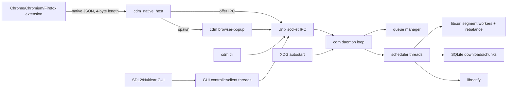

# cdm Project Context

Audit refreshed 2026-09-25 after phase 1 task 1.5.3. This document is self-contained for an assistant without repository access. Relative paths refer to the refreshed source state. Literal user data and absolute home paths are omitted or shown as `[REDACTED]`.

## 0. Metadata

| Item | Current value |
|---|---|
| Audit refresh | 2026-09-25, after phase 1 task 1.5.3; older line references are approximate where intervening code moved. |
| Repository root | `[REDACTED]` (this checkout's root; `git rev-parse --show-toplevel`) |
| Pre-document commit | `18c537046e1ecb1f65a58f7163902324dd5d9879` (`git rev-parse HEAD`) |
| Branch | `cdm` (`git branch --show-current`; user requested work on this branch) |
| Last commit before refresh | `18c537046e1ecb1f65a58f7163902324dd5d9879 2026-09-25 09:00:09 +0600 feat(gui): enable remove and delete-file from row menu` |
| Working tree before refresh | `.gitignore` modified by pre-existing local work; `PLAN.md` is ignored locally. The earlier unrelated stash is preserved. This task edits this document and release notes. |
| Host/toolchain | Linux x86_64, Arch Linux, GCC 16.2.1, CMake 4.4.3; system libcurl 8.22.0, SQLite 3.53.4, SDL2 2.32.72, libnotify 0.8.8, libepoxy 1.5.10, Criterion 2.4.3. |
| UI library | Vendored Nuklear v4.13.3 (`src/vendor/nuklear.h`); runtime SDL/OpenGL version UNKNOWN, verify with package manager or linked binaries. |
| Release | `.release.toml` specifies 0.3.0-rc1, CPack 0.3.0~rc1; README's 0.2.0-rc1 remains stale. |

This is a source and local-test snapshot, not a claim that every runtime path works. Home-specific values, URLs and credentials are omitted or replaced with `[REDACTED]`.

## 1. Executive Summary

`cdm` is a Linux C11 HTTP(S) download manager. One executable dispatches daemon, CLI, GUI, browser popup, browser host installation, and daemon autostart commands (`src/main.c`). The daemon owns an in-memory queue, SQLite `downloads`/`chunks`, a per-user Unix-domain IPC socket, scheduler threads, and libcurl segment workers (`src/daemon/daemon.c`, `src/core/scheduler.c`). `cdm_native_host` bridges Chromium/Firefox native messaging to daemon offers and starts the confirmation popup (`src/native_host/main_host.c`). Phase 0 added safe probing/naming/resume validators, daemon speed/ETA events, paginated history and `cdm cli list`. Phase 1 added proxy configuration, per-download HTTP Basic credentials, connection/User-Agent/timeout knobs, normalized active-URL duplicate rejection, and history removal with optional file deletion. GUI history loads a 256-row window in 64-row increments (`src/gui/gui_controller.c`).

## 2. Current Feature Inventory

| Feature | Current implementation and limit |
|---|---|
| HTTP(S) segmented download | Default eight curl workers, configurable 1–16, ranges/rebalancing, 200/206 validation, fallback, retries (`src/engine/engine_runner.c`, `src/engine/worker_pool.c`, `src/utils/config.h`). |
| Metadata probe and naming | HEAD with a GET `Range: bytes=0-0` fallback; bounded body on ignored ranges; `Content-Disposition` `filename`/UTF-8 `filename*`, URL percent decoding, and daemon rename for automatically derived destinations (`src/platform/curl_client.c:111`, `src/utils/path.c`, `src/engine/engine_runner.c:88`). |
| Resume and integrity | Persisted ETag/Last-Modified; changed validator clears chunks and restarts; `If-Range` on resumed ranges. Size and optional SHA-256 verification remain (`src/engine/engine_runner.c:211`, `src/engine/finalize.c`). |
| Queue and speed limits | Persisted downloads/chunks, pause/resume/cancel, retry backoff, global/per-download bytes/sec caps. Proxy HTTP/SOCKS5 and per-download Basic auth apply to probe and workers (`src/core/scheduler.c`, `src/platform/bandwidth.c`, `src/platform/curl_client.c`, `src/engine/worker_pool.c`). |
| IPC progress | Protocol version 4 HELLO; v2 status event type 33 still carries bytes, total, speed B/s, ETA seconds, fraction/status/error (`src/platform/ipc_protocol.h`, `src/platform/ipc_socket.c`). |
| History | Legacy `MSG_LIST_ALL` still returns at most 200; type 35 pages 500 max; type 36 adds recorded size per row. GUI scrolls through a bounded window; CLI `list` pages and filters by status (`src/platform/ipc_socket.c`, `src/gui/gui_controller.c`, `src/cli/cli.c`). |
| GUI/browser | SDL/Nuklear GUI with search/categories, add/details/settings, remove-from-list/delete-file row actions; popup confirms offered downloads and shows speed/ETA or duplicate notice. Chrome, Chromium, Firefox native handoff (`src/gui/gui_nuklear.c`, `src/gui/browser_popup.c`, `browser/`). |
| Notifications/autostart | libnotify completion/failure, XDG autostart (`src/utils/notify.c`, `src/platform/daemon_autostart.c`). |
| Missing or partial | No tray, clipboard monitor, persisted user categories, queue priorities/schedule UI, browser cookies/headers, site rules or broader browser installer support. Global GUI search/category filters apply only to the loaded history window. Cookies, HTTP Basic password and proxy password remain plaintext in local persistence. |

## 3. Architecture Overview



| Component | Files, public interface, communication/thread/error model |
|---|---|
| Entrypoint/daemon | `src/main.c:60`, `src/daemon/daemon.c:96`; main dispatch, singleton `flock`, double fork when stdin is not TTY, 200 ms loop (scheduler, progress DB flush, bandwidth tick, IPC poll). Signal shutdown joins workers before DB close. Returns 1 on startup errors. |
| Queue/scheduler | `src/core/queue_manager.[ch]`, `scheduler.[ch]`; linked list under global `dm_mutex_t`, atomics for flags and counters; one scheduler thread per active download, max 64 slots (`src/core/scheduler.c:19`); each may spawn 1–16 curl workers. Scheduler maps engine return values to status/retry/notifications. `queue_manager_forget_locked()` removes a non-ACTIVE entry without unlinking its file while the queue mutex is held (`src/core/queue_manager.c`). |
| Engine/platform | `src/engine/{engine_runner,segmenter,worker_pool,finalize}.[ch]`, `src/platform/{curl_client,file_io,bandwidth,sha256,thread}.[ch]`; HEAD with bounded GET range fallback, validator-aware resume, range plan, preallocation, positional writes, work stealing, fallback and verification. Error outcomes `0/-1/-2/-3/-4` in `src/engine/engine_runner.h:20`. |
| Persistence | `src/persistence/db.[ch]`; one process-global SQLite handle, schema/migration/query/restore. Called by daemon poll and workers; no explicit DB mutex (`src/persistence/db.c:17`). |
| IPC | `src/platform/{ipc_protocol,ipc_socket}.[ch]`; Linux Unix-domain server, max 16 clients, v4 HELLO on v1 framing, mixed binary/length-prefixed strings/JSON, page types 35/36, duplicate response types 42/43 and remove type 44. Main poll dispatches commands; worker broadcasts use client mutex and nonblocking `send`, dropping slow clients (`src/platform/ipc_socket.c`). |
| GUI | `src/gui/gui_nuklear.c`, `gui_backend_sdl.c`, `gui_controller.c`, `gui_client.c`, `gui_model.c`; SDL/OpenGL main thread draws, controller worker queues commands/events (64/256 slots) and refreshes every 2 s, client listener subscribes to status events (512 slots); mutexed model. See `src/gui/gui_controller.c:12`, `src/gui/gui_client.c:11`. |
| Browser bridge/popup | `browser/{chromium,firefox}`, `src/native_host/{main_host,browser_install}.c`, `src/gui/browser_popup.c`; native host select loop polls offers every 250 ms, max 64, popup UI uses IPC confirm/dismiss/subscribe. Browser offers expire after 600 seconds unless confirmed and running (`src/platform/ipc_socket.c:33`, `:160`). |
| Packaging/notifications | `CMakeLists.txt:260`, `resources/autostart/cdm-daemon.desktop.in`, `src/platform/daemon_autostart.c`, `src/utils/notify.c`; installed XDG entry, per-user override, libnotify complete/failure. |

## 4. Repository File Map

Full tracked inventory with one-line purposes appears below. Tree (source and supporting files; no build/cache outputs):

```text
.
├── .github/workflows/             release-deb.yml, release-rpm.yml
├── assets/fonts/                  Liberation Sans regular/bold and licenses
├── browser/{chromium,firefox}/     MV3 manifests and background scripts
├── cmake/                         font embedding, extension validation/bundles
├── docs/ui/browser-integration/   static browser UI concepts
├── packaging/{arch,deb,deps}/     PKGBUILD, conffiles, dependency scripts
├── resources/{autostart,native-messaging}/ desktop/host templates
├── scripts/                       release and source-artifact helpers
├── src/{cli,core,daemon,engine,gui,native_host,persistence,platform,utils,vendor}/
└── tests/                         Criterion C, Python integration, JS extension tests
```

**Tracked files (`git ls-files`, including this document after its task commit):**

| Tracked relative path | Purpose |
|---|---|
| `.gitattributes` | Git attribute settings. |
| `.github/workflows/release-deb.yml` | Release packaging CI workflow. |
| `.github/workflows/release-rpm.yml` | Release packaging CI workflow. |
| `.gitignore` | Ignored generated outputs. |
| `.release.toml` | Release channel/version source. |
| `CMakeLists.txt` | C11 targets, dependencies, tests, install and CPack rules. |
| `CONTRIBUTING.md` | Build/test/dependency contributor guide. |
| `LICENSE` | MIT license. |
| `PROJECT_CONTEXT.md` | Self-contained project audit and phase 0 state for a planning assistant. |
| `README.md` | Project overview and quick start. |
| `SECURITY.md` | Vulnerability reporting policy. |
| `assets/fonts/LICENSE` | Embedded GUI font asset or its license/notes. |
| `assets/fonts/LiberationSans-Bold.ttf` | Embedded GUI font asset or its license/notes. |
| `assets/fonts/LiberationSans-Regular.ttf` | Embedded GUI font asset or its license/notes. |
| `assets/fonts/README.md` | Embedded GUI font asset or its license/notes. |
| `browser/chromium/README.md` | Browser-specific installation notes. |
| `browser/chromium/manifest.json` | Extension manifest/permissions. |
| `browser/chromium/service_worker.js` | Download interception/native host messaging logic. |
| `browser/firefox/README.md` | Browser-specific installation notes. |
| `browser/firefox/background.js` | Download interception/native host messaging logic. |
| `browser/firefox/manifest.json` | Extension manifest/permissions. |
| `cmake/BundleBrowserExtension.py` | CMake helper for bundlebrowserextension. |
| `cmake/EmbedFont.cmake` | CMake helper for embedfont. |
| `cmake/ValidateBrowserExtensions.cmake` | CMake helper for validatebrowserextensions. |
| `docs/RELEASE_CHECKLIST.md` | User/release documentation. |
| `docs/RELEASE_NOTES.md` | User/release documentation. |
| `docs/agent-log.md` | Per-task implementation, test and next-step log. |
| `docs/browser-integration.md` | User/release documentation. |
| `docs/daemon-autostart.md` | User/release documentation. |
| `docs/ipc.md` | Current v1/v2 Unix socket wire protocol and compatibility reference. |
| `docs/open-questions.md` | Resolved and pending design choices. |
| `docs/ui/browser-integration/confirm.html` | Static UI design mockup, not runtime application. |
| `docs/ui/browser-integration/progress.html` | Static UI design mockup, not runtime application. |
| `docs/ui/mockup.html` | Static UI design mockup, not runtime application. |
| `packaging/arch/PKGBUILD` | Package metadata or conffile list. |
| `packaging/deb/conffiles` | Package metadata or conffile list. |
| `packaging/deps/arch.sh` | Dependency installation helper; may modify system if run. |
| `packaging/deps/deb.sh` | Dependency installation helper; may modify system if run. |
| `packaging/deps/rpm.sh` | Dependency installation helper; may modify system if run. |
| `resources/autostart/cdm-daemon.desktop.in` | Installed desktop/autostart/native-host template. |
| `resources/cdm.desktop` | Installed desktop/autostart/native-host template. |
| `resources/native-messaging/chromium.json.in` | Installed desktop/autostart/native-host template. |
| `resources/native-messaging/firefox.json.in` | Installed desktop/autostart/native-host template. |
| `scripts/cdm-release` | Release/build artifact helper; may write outside build directory if run. |
| `scripts/generate_release_artifacts.sh` | Release/build artifact helper; may write outside build directory if run. |
| `scripts/make-source-tarball.sh` | Release/build artifact helper; may write outside build directory if run. |
| `src/cli/cli.c` | cli cli implementation. |
| `src/cli/cli.h` | cli cli public declarations/interface. |
| `src/core/download_record.h` | core download record public declarations/interface. |
| `src/core/queue_manager.c` | core queue manager implementation. |
| `src/core/queue_manager.h` | core queue manager public declarations/interface. |
| `src/core/scheduler.c` | core scheduler implementation. |
| `src/core/scheduler.h` | core scheduler public declarations/interface. |
| `src/daemon/daemon.c` | daemon daemon implementation. |
| `src/daemon/daemon.h` | daemon daemon public declarations/interface. |
| `src/engine/engine_runner.c` | engine engine runner implementation. |
| `src/engine/engine_runner.h` | engine engine runner public declarations/interface. |
| `src/engine/finalize.c` | engine finalize implementation. |
| `src/engine/finalize.h` | engine finalize public declarations/interface. |
| `src/engine/segmenter.c` | engine segmenter implementation. |
| `src/engine/segmenter.h` | engine segmenter public declarations/interface. |
| `src/engine/worker_pool.c` | engine worker pool implementation. |
| `src/engine/worker_pool.h` | engine worker pool public declarations/interface. |
| `src/gui/browser_popup.c` | gui browser popup implementation. |
| `src/gui/browser_popup.h` | gui browser popup public declarations/interface. |
| `src/gui/gui_backend_sdl.c` | gui gui backend sdl implementation. |
| `src/gui/gui_backend_sdl.h` | gui gui backend sdl public declarations/interface. |
| `src/gui/gui_client.c` | gui gui client implementation. |
| `src/gui/gui_client.h` | gui gui client public declarations/interface. |
| `src/gui/gui_controller.c` | gui gui controller implementation. |
| `src/gui/gui_controller.h` | gui gui controller public declarations/interface. |
| `src/gui/gui_model.c` | gui gui model implementation. |
| `src/gui/gui_model.h` | gui gui model public declarations/interface. |
| `src/gui/gui_nuklear.c` | gui gui nuklear implementation. |
| `src/main.c` | main.c main implementation. |
| `src/native_host/browser_install.c` | native_host browser install implementation. |
| `src/native_host/browser_install.h` | native_host browser install public declarations/interface. |
| `src/native_host/main_host.c` | native_host main host implementation. |
| `src/persistence/db.c` | persistence db implementation. |
| `src/persistence/db.h` | persistence db public declarations/interface. |
| `src/platform/bandwidth.c` | platform bandwidth implementation. |
| `src/platform/bandwidth.h` | platform bandwidth public declarations/interface. |
| `src/platform/curl_client.c` | platform curl client implementation. |
| `src/platform/curl_client.h` | platform curl client public declarations/interface. |
| `src/platform/daemon_autostart.c` | platform daemon autostart implementation. |
| `src/platform/daemon_autostart.h` | platform daemon autostart public declarations/interface. |
| `src/platform/diskspace.c` | platform diskspace implementation. |
| `src/platform/diskspace.h` | platform diskspace public declarations/interface. |
| `src/platform/file_io.c` | platform file io implementation. |
| `src/platform/file_io.h` | platform file io public declarations/interface. |
| `src/platform/ipc_protocol.h` | platform ipc protocol public declarations/interface. |
| `src/platform/ipc_socket.c` | platform ipc socket implementation. |
| `src/platform/ipc_socket.h` | platform ipc socket public declarations/interface. |
| `src/platform/open_path.c` | platform open path implementation. |
| `src/platform/open_path.h` | platform open path public declarations/interface. |
| `src/platform/sha256.c` | platform sha256 implementation. |
| `src/platform/sha256.h` | platform sha256 public declarations/interface. |
| `src/platform/spawn.c` | platform spawn implementation. |
| `src/platform/spawn.h` | platform spawn public declarations/interface. |
| `src/platform/thread.c` | platform thread implementation. |
| `src/platform/thread.h` | platform thread public declarations/interface. |
| `src/utils/config.c` | utils config implementation. |
| `src/utils/config.h` | utils config public declarations/interface. |
| `src/utils/log.c` | utils log implementation. |
| `src/utils/log.h` | utils log public declarations/interface. |
| `src/utils/notify.c` | utils notify implementation. |
| `src/utils/notify.h` | utils notify public declarations/interface. |
| `src/utils/path.c` | utils path implementation. |
| `src/utils/path.h` | utils path public declarations/interface. |
| `src/utils/url.c` | Normalizes HTTP(S) scheme/host/default port/fragment for active URL duplicate lookup. |
| `src/utils/url.h` | URL normalization interface. |
| `src/vendor/cJSON.c` | Vendored third-party cJSON.c implementation/interface. |
| `src/vendor/cJSON.h` | Vendored third-party cJSON.h implementation/interface. |
| `src/vendor/nuklear.h` | Vendored third-party nuklear.h implementation/interface. |
| `src/vendor/nuklear_sdl_gl3.h` | Vendored third-party nuklear_sdl_gl3.h implementation/interface. |
| `src/vendor/tinyfiledialogs.c` | Vendored third-party tinyfiledialogs.c implementation/interface. |
| `src/vendor/tinyfiledialogs.h` | Vendored third-party tinyfiledialogs.h implementation/interface. |
| `src/vendor/tomlc17.c` | Vendored third-party tomlc17.c implementation/interface. |
| `src/vendor/tomlc17.h` | Vendored third-party tomlc17.h implementation/interface. |
| `tests/CMakeLists.txt` | Python/JavaScript integration, protocol, browser, or GUI smoke test for CMakeLists.txt. |
| `tests/smoke_browser_popup.py` | Python/JavaScript integration, protocol, browser, or GUI smoke test for smoke_browser_popup.py. |
| `tests/test_browser_autostart.py` | Python/JavaScript integration, protocol, browser, or GUI smoke test for test_browser_autostart.py. |
| `tests/test_browser_end_to_end.py` | Python/JavaScript integration, protocol, browser, or GUI smoke test for test_browser_end_to_end.py. |
| `tests/test_browser_extensions.js` | Python/JavaScript integration, protocol, browser, or GUI smoke test for test_browser_extensions.js. |
| `tests/test_browser_install.py` | Python/JavaScript integration, protocol, browser, or GUI smoke test for test_browser_install.py. |
| `tests/test_cli_headers.py` | Loopback CLI add/header lifetime and destination integration. |
| `tests/test_cli_duplicates.py` | Loopback daemon/CLI duplicate URL and existing-ID integration. |
| `tests/test_cli_list.py` | 600-row paginated CLI list/size/status integration. |
| `tests/test_cli_rejected_add.py` | Daemon rejection must produce nonzero CLI exit. |
| `tests/test_config.c` | Criterion tests for TOML/defaults, proxy and network settings. |
| `tests/test_curl_client.c` | Criterion C test for curl client. |
| `tests/test_curl_http_integration.c` | Criterion C test for curl http integration. |
| `tests/test_daemon_lifecycle.py` | Python/JavaScript integration, protocol, browser, or GUI smoke test for test_daemon_lifecycle.py. |
| `tests/test_db.c` | Criterion C test for db. |
| `tests/test_engine_http_integration.c` | Criterion C test for engine http integration. |
| `tests/test_engine_runner.c` | Criterion C test for engine runner. |
| `tests/test_file_io.c` | Criterion C test for file io. |
| `tests/test_finalize.c` | Criterion C test for finalize. |
| `tests/test_gui_controller.c` | Criterion C test for gui controller. |
| `tests/test_url.c` | Criterion tests for normalized URL equality and invalid URLs. |
| `tests/test_ipc.c` | Criterion C test for ipc. |
| `tests/test_ipc_fallback.py` | Legacy daemon HELLO fallback integration. |
| `tests/test_ipc_socket.c` | Criterion C test for ipc socket. |
| `tests/test_log.c` | Criterion C test for log. |
| `tests/test_native_host_protocol.py` | Python/JavaScript integration, protocol, browser, or GUI smoke test for test_native_host_protocol.py. |
| `tests/test_path.c` | Criterion C test for path. |
| `tests/test_queue_manager.c` | Criterion C test for queue manager. |
| `tests/test_scheduler.c` | Criterion C test for scheduler. |
| `tests/test_segmenter.c` | Criterion C test for segmenter. |
| `tests/test_spawn.c` | Criterion C test for spawn. |
| `tests/test_thread.c` | Criterion C test for thread. |
| `tests/test_worker_pool.c` | Criterion C test for worker pool. |

`PLAN.md` is ignored locally; `.gitignore` has a pre-existing unstaged change. Build/cache outputs are excluded from the tree. This file map reflects the tracked source after phase 1 task 1.5.3.

## 5. Build, Test, and Run

```sh
# From repository root; build/ is ignored. A disposable /tmp build also works.
cmake -S . -B build -DBUILD_TESTING=ON -DCMAKE_BUILD_TYPE=Debug
cmake --build build -j
ctest --test-dir build --output-on-failure
# Optional sanitizer: -DDOWNLOADMGR_SANITIZER=address|undefined|thread
# Packaging from a configured /usr prefix: cpack --config build/CPackConfig.cmake -G DEB|RPM
build/cdm daemon
build/cdm gui                  # also: cdm or cdm ui
build/cdm cli add https://example.invalid/file.bin [dest_dir]
build/cdm cli pause 1         # resume / cancel likewise
build/cdm cli list --offset 0 --limit 100 --status DONE
build/cdm daemon status       # enable / disable likewise
build/cdm browser install --chrome --id EXTENSION_ID
build/cdm browser install --chromium --id EXTENSION_ID
build/cdm browser install --firefox --id browser@cdm.local
build/cdm browser uninstall --chrome  # chromium/firefox likewise
```

`cdm_native_host` is launched by the browser over stdin/stdout, not normally run interactively (`src/native_host/main_host.c:316`). Internal popup: `cdm browser-popup --offer ID` (`src/main.c:99`). GUI/CLI auto-start daemon and wait up to 5 s; daemon daemonizes when stdin is non-TTY (`src/main.c:30`, `src/daemon/daemon.c:132`). Release scripts can modify packaging files/build outputs; audit did not run them. CMake embeds fonts and validates/zips extensions (`CMakeLists.txt:153`, `:232`). CPack DEB/RPM and Arch PKGBUILD (`CMakeLists.txt:260`, `packaging/arch/PKGBUILD:1`); system install adds `/etc/xdg/autostart/cdm-daemon.desktop`. `scripts/cdm-release` supports `arch`, `test`, `doctor`, and package paths (`scripts/cdm-release:425`). No `.pc.in` or Dockerfile is tracked.

## 6. Dependencies and Platform Support

Required: C11 compiler, CMake >=3.20, pkg-config, Python 3, libnotify, SDL2, libepoxy, OpenGL, SQLite >=3.24, libcurl >=7.60 (system default), pthreads on Unix; Criterion if `BUILD_TESTING=ON` (`CMakeLists.txt:1`, `:61`, `:103`, `:192`). `DOWNLOADMGR_USE_SYSTEM_CURL=OFF` fetches pinned curl `curl-8_21_0` via Git; needs network and curl build dependencies (`CMakeLists.txt:77`). Node is optional for JS tests (`tests/CMakeLists.txt:77`). Warnings default on (`-Wall -Wextra -Wpedantic`); sanitizer cache option accepts `address`, `undefined`, `thread` (`CMakeLists.txt:11`). Vendored cJSON, tinyfiledialogs, tomlc17, Nuklear (`CMakeLists.txt:121`, `src/vendor/nuklear.h:1`). Distro package dependency names: `packaging/deps/{deb,rpm,arch}.sh`; DEB declares GUI libs and shlibdeps, RPM declares GUI libs/autoreq (`CMakeLists.txt:355`). DEB CI builds/tests; RPM release workflow builds/packages (`.github/workflows/release-deb.yml:95`, `release-rpm.yml:93`). README explicitly supports Linux; Windows/macOS are roadmap only (`README.md:1`, `:68`). POSIX `fork`, `flock`, Unix sockets, `pwrite`, `unistd`, XDG paths and libnotify block Windows/macOS despite partial `_WIN32` wrappers (`src/daemon/daemon.c:70`, `src/platform/ipc_socket.c:19`, `src/platform/thread.c:7`).

## 7. IPC Protocol Reference

Source of truth: `src/platform/ipc_protocol.h`, `src/platform/ipc_socket.h`, and `src/platform/ipc_socket.c`. The transport is a per-user Unix stream socket (`XDG_RUNTIME_DIR/cdm.sock`, otherwise `$HOME/.local/share/cdm/ipc.sock`, otherwise `/tmp/cdm_<uid>.sock`). The socket is created with mode `0600` (`src/platform/ipc_socket.c:83`, `src/platform/ipc_socket.c:982`). The daemon accepts at most 16 clients (`src/platform/ipc_socket.c:32`).

### Framing and negotiation

Every **request** and asynchronous **event** begins with the unchanged v1 `MsgHeader`: `uint32_t length` (payload bytes, excluding the header), then `MsgType type` (C enum; four bytes on the supported ABI). The current header is eight bytes. Integers, `float`, and raw structs use native byte order, size, alignment, and padding; this is a local, same-ABI protocol, not a portable network format. Strings in length-prefixed fields are byte sequences without a wire NUL: `uint32_t length`, then exactly that many bytes. Fixed `char[]` fields in raw structs are NUL-terminated when populated. Request payloads over `IPC_MAX_FRAME_SIZE = 16384` bytes or with an invalid type/length are rejected by closing the connection (`src/platform/ipc_socket.c:400`). **Command replies have no `MsgHeader`**; their layouts are listed below. Event frames do have a header.

`MSG_HELLO` (41) is a v1-framed empty request. Its unframed reply is native `uint16_t IPC_PROTOCOL_VERSION`, currently **4**. `ipc_client_connect_compatible()` uses a bounded HELLO exchange; if an old daemon closes or fails the exchange, the client reconnects and treats it as v1. Clients use capability thresholds: version >=2 for rich progress/pages, >=3 for duplicate-aware add/confirm, >=4 for remove. Existing v1 types and payloads remain byte-compatible; new fields use a new message type, not an appended legacy wire struct (`src/platform/ipc_protocol.h`, `src/platform/ipc_socket.c`).

### Message registry

Types 1–17 are legacy. Type 7 exists in the enum but has no producer or request handler.

| Type | Name | Request payload → unframed reply, or event payload |
| ---: | --- | --- |
| 1 | `MSG_ADD_DOWNLOAD` | Three length-prefixed strings: URL, destination path, options JSON → `uint32_t download_id` (`0` on failure). Explicit destination basename. |
| 2 | `MSG_PAUSE` | `uint32_t download_id` → `uint8_t IpcResult`. |
| 3 | `MSG_RESUME` | `uint32_t download_id` → `uint8_t IpcResult`. |
| 4 | `MSG_CANCEL` | `uint32_t download_id` → `uint8_t IpcResult`. |
| 5 | `MSG_LIST` | Empty → `uint32_t` count of active plus queued downloads. |
| 6 | `MSG_STATUS_EVENT` | Event: `uint32_t download_id`, `float progress` (fraction 0–1), `uint32_t status_len`, then status text bytes. |
| 7 | `MSG_PROGRESS_EVENT` | Reserved/unimplemented; no event is emitted; rejected as a request. |
| 8 | `MSG_SUBSCRIBE` | Empty → no reply; subscribe to type 6 events. |
| 9 | `MSG_LIST_ALL` | Empty → `uint32_t count`, then `count` rows (layout below). Capped at 200; excess rows are silently omitted. |
| 10 | `MSG_GET_DETAILS` | `uint32_t download_id` → `uint8_t found` (0/1), then details if found (layout below). |
| 11 | `MSG_RELOAD_CONFIG` | Empty → `uint8_t IpcResult`. |
| 12 | `MSG_BROWSER_OFFER` | UTF-8 JSON offer → raw `IpcBrowserOffer` (all zero / `offer_id=0` on failure). |
| 13 | `MSG_BROWSER_GET_OFFER` | `uint32_t offer_id` → raw `IpcBrowserOffer` (zero if absent). |
| 14 | `MSG_BROWSER_CONFIRM` | `uint32_t offer_id`, `uint32_t path_len`, `path_len` destination bytes → `uint32_t download_id` (`0` on failure). |
| 15 | `MSG_BROWSER_DISMISS` | `uint32_t offer_id` → `uint8_t IpcResult`. |
| 16 | `MSG_BROWSER_SUBSCRIBE_PROGRESS` | `uint32_t download_id` → initial raw `IpcBrowserProgress` snapshot; later type 17 events for that ID. Unknown ID yields `status="NOT_FOUND"`. |
| 17 | `MSG_BROWSER_PROGRESS_EVENT` | Event: raw `IpcBrowserProgress`. |
| 32 | `MSG_ADD_DOWNLOAD_AUTO` | Same layout/reply as type 1; daemon may rename an automatically derived destination after probing headers. |
| 33 | `MSG_STATUS_EVENT_V2` | Event: raw `IpcProgressV2`. Sent only to v2 subscribers. |
| 34 | `MSG_SUBSCRIBE_V2` | Empty → no reply; opts this socket into type 33 events. |
| 35 | `MSG_LIST_PAGE` | `uint32_t offset`, `uint32_t limit` → `uint32_t total`, `uint32_t returned`, then `returned` rows in the type 9 row layout. `limit` is capped at 500; `total` is the full database count before paging. |
| 36 | `MSG_LIST_PAGE_WITH_SIZE` | Same request and page header as type 35; each row adds native `uint64_t total_size` (bytes; `0` means unknown) after `float progress`. Used by `cdm cli list`. |
| 37 | `MSG_GET_DETAILS_V2` | Same `uint32_t download_id` request and legacy details reply as type 10, followed by length-prefixed `auth_user` and `uint8_t has_password`. The password is never sent back. |
| 41 | `MSG_HELLO` | Empty → raw `uint16_t` daemon protocol version. |
| 42 | `MSG_ADD_DOWNLOAD_V2` | Same three length-prefixed strings as type 1; options JSON also includes boolean `auto_filename`. Reply is native `uint32_t result`, then `uint32_t id`. Duplicate active URL: `REJECTED` plus existing ID. |
| 43 | `MSG_BROWSER_CONFIRM_V2` | Same offer ID/path payload as type 14; reply is native `uint32_t result`, then `uint32_t id`. Duplicate URL: `REJECTED` plus existing ID. Reconfirming an offer preserves its result. |
| 44 | `MSG_REMOVE_DOWNLOAD` | `uint32_t id`, then `uint8_t delete_file` (0 keeps file, nonzero unlinks after DB commit) → `uint8_t IpcResult`. Refuses ACTIVE; emits `REMOVED` status event on success. The plan's proposed ID 34 was occupied by `MSG_SUBSCRIBE_V2`. |

`IpcResult`: `OK=0`, `NOT_FOUND=1`, `REJECTED=2`, `ERROR=3` (`src/platform/ipc_protocol.h`). `MSG_LIST_ALL` and `MSG_LIST_PAGE` rows are **field-by-field**, not raw `DownloadListRecord`: `uint32_t id`, length-prefixed `url`, `dest_path`, `status`, and `float progress` (0–1). Type 36 uses that row layout plus `uint64_t total_size` at the end. `IPC_LIST_ALL_MAX=200` and `IPC_LIST_PAGE_MAX=500` are defined in `src/platform/ipc_socket.h`; listing uses database order, currently newest first (`src/platform/ipc_socket.c`, `src/persistence/db.c`). An old v1 daemon lacks pages; reconnect and use type 9. CLI requires type 36 to report daemon-recorded size. `MSG_GET_DETAILS` success data is length-prefixed `cookie`, `referrer`, `extra_headers`, `expected_sha256` strings, followed by `uint64_t speed_limit_bps` (bytes/second). Type 37 adds `auth_user`/`has_password`. Add options JSON accepts those keys plus `auth_user` and `auth_password`; `extra_headers` is newline-delimited. Malformed JSON is ignored rather than rejecting the download (`src/platform/ipc_socket.c`). URL capacity is 2048 bytes including NUL, destination 1024 including NUL (`src/platform/ipc_protocol.h`).

### Event structs and subscriptions

`IpcProgressV2` (`src/platform/ipc_protocol.h:53`; raw payload of type 33):

| Field | Type | Meaning |
| --- | --- | --- |
| `download_id` | `uint32_t` | Download identifier. |
| `bytes_received` | `uint64_t` | Completed bytes. |
| `total_bytes` | `uint64_t` | Expected bytes; `0` means unknown. |
| `speed_bps` | `uint64_t` | Daemon-sampled transfer bytes/second; `0` means not yet known. |
| `eta_seconds` | `uint64_t` | Estimated remaining seconds; `UINT64_MAX` means unknown. |
| `progress` | `float` | Fraction 0–1; `-1` means indeterminate. |
| `status` | `char[24]` | NUL-terminated scheduler status text. |
| `error` | `char[256]` | NUL-terminated error text, empty if none. |

`IpcBrowserProgress` (`src/platform/ipc_socket.h:41`; initial reply and raw payload of type 17) contains `uint32_t download_id`, `uint64_t bytes_received` (bytes), `uint64_t total_bytes` (bytes; 0 unknown), `float progress` (fraction 0–1), `char status[24]` (NUL-terminated canonical state such as `ACTIVE`), `char error[256]` (NUL-terminated), and `char dest_path[1024]` (NUL-terminated). This legacy struct has no speed or ETA.

A general type 34 subscriber gets **type 33 then type 6** on each status broadcast; a type 8 subscriber gets only type 6. A browser-specific socket first sends type 16 and consumes its unframed snapshot; it can then send type 34 on the **same socket** to get **type 33 then type 17** for that download. Without type 34 it gets only type 17. Browser-specific v2 subscription does not subscribe to all downloads. Consumers must read or skip both frames in a paired broadcast to keep the stream aligned. Slow or partially written nonblocking event sockets are removed (`src/platform/ipc_socket.c:1561`).

### Browser offer struct

Type 12 JSON accepts `request_id` (required string, max 127 bytes), `url` (required HTTP(S) string, max 2047), `filename` (optional string, max 511), `mime` (optional string, max 127), `referrer` (optional string, max 2047), and `total_bytes` (optional nonnegative JSON number up to 2^53−1, bytes). The raw `IpcBrowserOffer` reply (`src/platform/ipc_socket.h:29`) has `uint32_t offer_id` (`0` means absent/failure), `uint32_t download_id` (`0` until confirmed), `uint64_t total_bytes` (bytes; `0` unknown), `IpcBrowserOfferState state` (`WAITING=0`, `CONFIRMED=1`, `DISMISSED=2`), and NUL-terminated arrays `request_id[128]`, `url[2048]`, `filename[512]`, `mime[128]`, `referrer[2048]`. Offers are held in 64 in-memory slots for 600 seconds; the same `request_id`/URL retrieves the same offer. Confirming a waiting offer queues once; repeat confirm returns its download ID. Dismiss is idempotent for a dismissed offer (`src/platform/ipc_socket.c:34`, `src/platform/ipc_socket.c:242`, `src/platform/ipc_socket.c:585`).

The socket carries sensitive options and `MSG_GET_DETAILS` can return plaintext cookies and headers. HTTP Basic password is accepted on add but hidden from the type 37 response; proxy credentials are in TOML, not sent on this IPC. Only connect trusted same-user processes; the protocol has no additional peer authentication or encryption. Raw structs and enum widths must match between client and daemon builds.

## 8. Database Schema and Persistence

SQLite path `$HOME/.local/share/cdm/downloads.db`; daemon migrates the old `$HOME/.local/share/downloadmgr` directory if needed (`src/daemon/daemon.c:45`, `:165`). The single process-global `sqlite3 *g_db` enables foreign keys and requests WAL (`src/persistence/db.c:17`, `:59`). Current creation DDL (`src/persistence/db.c:73`):

```sql
CREATE TABLE IF NOT EXISTS downloads (
 id INTEGER PRIMARY KEY, url TEXT NOT NULL, dest_path TEXT NOT NULL,
 total_size INTEGER DEFAULT 0, status TEXT DEFAULT 'QUEUED',
 priority INTEGER DEFAULT 0, created_at INTEGER,
 cookie TEXT DEFAULT '', referrer TEXT DEFAULT '', extra_headers TEXT DEFAULT '',
 expected_sha256 TEXT DEFAULT '', speed_limit_bps INTEGER DEFAULT 0,
 reserved_file INTEGER DEFAULT 0, etag TEXT DEFAULT '',
 last_modified TEXT DEFAULT '', auto_filename INTEGER DEFAULT 0,
 auth_user TEXT DEFAULT '', auth_password TEXT DEFAULT '');
CREATE TABLE IF NOT EXISTS chunks (
 download_id INTEGER, range_start INTEGER, range_end INTEGER,
 bytes_done INTEGER DEFAULT 0,
 FOREIGN KEY(download_id) REFERENCES downloads(id) ON DELETE CASCADE);
```

No explicit user index/UNIQUE on destination or chunk primary key; `downloads.id` uses SQLite's integer primary-key index. `created_at` is Unix seconds; byte sizes and ranges are stored as signed SQLite INTEGER, used as `uint64_t` in C (`src/persistence/db.c:75`, `:184`). Schema migration checks `PRAGMA table_info(downloads)` for eleven optional columns (`cookie`, `referrer`, `extra_headers`, `expected_sha256`, `speed_limit_bps`, `reserved_file`, `etag`, `last_modified`, `auto_filename`, `auth_user`, `auth_password`), adds missing ones inside one transaction, and sets `user_version=4`; it is idempotent but has no per-version ordered ledger (`src/persistence/db.c:114`). `db_find_active_by_url()` normalizes URLs while scanning QUEUED/ACTIVE/PAUSED rows; it has no normalized-URL index (`src/persistence/db.c`). `db_delete_download()` checks status, deletes chunks and row in an immediate transaction, then optionally unlinks the file; it returns 0 success, 1 ACTIVE, 2 missing, -1 DB error. Failed unlink logs a warning while the row stays deleted (`src/persistence/db.c`). `db_update_validators()` persists ETag and Last-Modified; auto-filename provenance and resolved destination are stored and restored. Settings stay in TOML; browser offers stay in memory.

Chunk state is `(download_id, inclusive range_start, inclusive range_end, bytes_done)`; live counters flush about every 200 ms, up to 64 chunk snapshots/tick (`src/core/scheduler.c`). Restore reloads unfinished rows and chunk progress, with a maximum of 16 chunks per download (`src/persistence/db.c`, `src/core/queue_manager.h`). The engine refuses a missing resume file, restarts when a stored validator differs from the new probe, sends `If-Range` on a resumed range when it has a strong ETag or Last-Modified, and still checks size/file length (`src/engine/engine_runner.c`). A validator absent on both old and new responses cannot prove content identity. DB queries include `db_count_downloads_total` and `db_visit_downloads_page` ordered by descending ID with `LIMIT/OFFSET`; legacy `db_count_downloads(max)`/`db_visit_downloads(max)` remain (`src/persistence/db.c`). `INSERT OR REPLACE` can delete old chunks through the FK on reused IDs. Plaintext cookies, referrers, headers and HTTP Basic credentials persist. More than `INT64_MAX` bytes is unsupported or unsafe (INFERRED from SQLite signed INTEGER binding).

## 9. Download Engine Internals

`engine_run_download` (`src/engine/engine_runner.c:170`) checks resume-file existence and HTTP(S) scheme, probes metadata, resolves automatic filename after headers, compares persisted validators/size, builds or resumes ranges, preallocates output, runs workers, flushes counters, retries a single full-file transfer after parallel failure, and verifies. Return codes remain `0` success, `-1` retryable, `-2` verification failure/file deleted, `-3` preexisting destination, `-4` missing resume file (`src/engine/engine_runner.h`). Scheduler retries `-1` with configured exponential backoff (defaults: five attempts, base 2 s, max 60 s); retry state is in memory (`src/core/scheduler.c`). Priority exists in `Download`/DB but has no user control.

Unknown or <1 MiB = one worker; [1,20) MiB = up to four; >=20 MiB = configured cap (default eight, max sixteen) (`src/engine/segmenter.c`). Ranges use inclusive ends. `RebalancePool` has up to 16 slots with atomic positions/live ends and a mutex; idle workers steal orphaned slots or split a busy tail if at least 1 MiB remains (`src/engine/worker_pool.c`). The split callback locks the queue mutex while mutating chunk state (`src/engine/engine_runner.c`). An in-flight curl write near a split boundary still merits stress testing.

Probe options include `CURLOPT_NOBODY`, redirects up to 10, configured UA (default `cdm/0.1`), configured total/connect timeouts (defaults 30/10 s) and `FAILONERROR`; on a failed HEAD it retries GET with `Range: 0-0`, aborts an ignored full body, and parses `Content-Range` for a 206 total (`src/platform/curl_client.c`). HTTP/SOCKS5 proxy and HTTP Basic auth are applied on the probe and workers; worker timeout uses `CURLOPT_LOW_SPEED_TIME` plus connect timeout. Headers capture Accept-Ranges, Content-Disposition, ETag and Last-Modified. Worker options include ranges, redirects, cookies/referrer/extra headers, low-speed timeout, per-worker cap and `If-Range` on resume (`src/engine/worker_pool.c`). `Content-Disposition` prefers valid UTF-8 `filename*`; unsafe names are rejected, URL names are percent-decoded, and explicit filenames stay unchanged (`src/utils/path.c`, `src/engine/engine_runner.c`). `engine_finalize` checks expected size and optional SHA-256 (`src/engine/finalize.c`). Whole-file unknown-size transfers and parallel-fallback chunk reset were fixed in phase 0. Global bandwidth token bucket and per-download curl cap are bytes/sec; per-worker division may underuse the cap if workers idle.

Transfer metrics are protected by the queue mutex: monotonic sampling and EMA with alpha 0.3 produce `speed_bps`; ETA is remaining bytes / speed rounded up, `UINT64_MAX` when unknown (`src/core/download_record.h`, `src/core/scheduler.c`). The single global SQLite connection has no explicit application lock despite worker/main-thread calls; confirm SQLite serialized mode and race behavior before widening concurrency. `Download *` returned after queue lock release warrants a lifetime audit (`src/core/queue_manager.c`).

## 10. CLI Reference

`cdm cli add URL [dest_dir] [--cookie V] [--referrer V] [--header "K: V"]... [--sha256 HEX] [--limit BYTES_PER_SEC]` treats destination as a directory, derives a provisional filename from the URL, reserves a unique path and requests daemon auto-filename resolution (`src/cli/cli.c`). The daemon may rename that provisional path after probing Content-Disposition. Repeated headers are joined with newlines in a caller-owned 4096-byte buffer; invalid option pairs fail; daemon rejection (`ID 0`) returns nonzero. On a version 3+ daemon, an active normalized URL duplicate prints `Already downloading (ID N)` and exits 0. There is no CLI flag for HTTP Basic username/password and no CLI history-remove command yet. Pause, resume and cancel take a positive uint32 ID and print success or stderr failure.

`cdm cli list [--offset N] [--limit N] [--status S]` prints TSV columns `id`, `status`, `percent`, `size`, `filename` in descending ID order. Defaults: offset 0, limit 100; limit accepts 1..500. Status is case-insensitive and must be one of QUEUED/ACTIVE/PAUSED/DONE/ERROR/CANCELED. With a status filter, the CLI scans raw daemon pages and applies offset **after** filtering. Size is daemon-recorded `total_size` in bytes; stored zero prints `?`. Unknown progress prints `?`. It uses type 36; a daemon without sized pages yields a clear error. Filenames replace tabs/newlines with spaces for TSV safety (`src/cli/cli.c`, `src/platform/ipc_socket.c`). No continuous CLI progress watch or JSON output exists.

## 11. GUI Reference

Main window: All/Downloading/Completed tabs, extension-derived sidebar categories, search, toolbar Add/Cancel/Pause/Resume/Settings, row progress/status, and context actions (`src/gui/gui_nuklear.c`). The row shows received/total bytes, daemon speed (bytes/sec formatted), ETA and per-row error from type 33 when known; v1 daemon fallback shows percent/path. Add dialog accepts URL/folder, cookie/referrer/headers/SHA-256/per-download speed cap; it has no HTTP Basic entry fields. Details retrieves stored request options via `MSG_GET_DETAILS` (including sensitive fields). Settings edits default directory, concurrency, retry knobs, global bytes/sec, HTTP/SOCKS5 proxy, connection cap, User-Agent and timeouts; saves TOML and requests daemon reload. Completion toast offers Open/Open folder, while system libnotify is separate. Row menu offers Remove from list, which keeps the file, and Delete file, which opens a confirmation dialog; ACTIVE rows cannot be removed. A duplicate add highlights the existing row and shows a toast (`src/gui/gui_nuklear.c`).

The controller worker fetches history every 2 s using type 35. Initial page is 64 rows; scrolling near the end requests 64 more without blocking rendering. After 256 rows, the window advances by 64 and the GUI adjusts scroll position. It displays loaded/total count and a loading row; an old daemon falls back to legacy type 9, so only its first 200 rows are available (`src/gui/gui_controller.c`, `src/gui/gui_client.c`, `src/gui/gui_nuklear.c`). Search/category/tab filters currently operate on the loaded window, not the full database. The controller has 64 queued commands, 256 events, and 256 row slots; the listener event queue has 512 slots. Model and queues use mutexes, the listener and controller each have a worker thread. No tray or clipboard monitoring; Copy URL uses SDL clipboard.

Browser popup: confirms URL/filename/directory, then shows byte counts, daemon speed and ETA from type 33, with legacy type 17 fallback and Open file/Open folder/Close controls. If its offered URL is already active, version 3+ confirmation reports the existing download ID and the popup shows `Already downloading` (`src/gui/browser_popup.c`). `docs/ui/*.html` are mockups, not runtime screens.

## 12. Browser Integration

Chromium/Firefox MV3 manifests request `downloads` and `nativeMessaging`; Chromium service worker and Firefox background script listen to `downloads.onCreated`, accept only in-progress HTTP(S), send native offer, then call browser `downloads.cancel` best effort (`browser/chromium/manifest.json:1`, `browser/chromium/service_worker.js:42`, `browser/firefox/manifest.json:1`, `browser/firefox/background.js:42`). No broad host permissions, webRequest, cookies, contextMenus or tabs permissions. Native JSON offer: `{type:"download_offer",request_id:UUID,url,referrer,filename,mime,total_bytes,browser}`. Host parses all except browser label, limits frame to 1 MiB, replies `offer_registered`, `offer_state` or `error`; each native frame has little-endian/native 4-byte length then JSON (`src/native_host/main_host.c:56`, `:108`, `:143`, `:164`). State can be waiting, confirmed, dismissed, started, complete or error; `offer_state` may carry progress fraction, bytes received, total bytes, error (`src/native_host/main_host.c:155`). Extension badge shows `!` for errors. Host launches daemon and detached popup (`src/native_host/main_host.c:219`). Popup confirm maps offer referrer to `RequestOptions` and reserves unique output (`src/platform/ipc_socket.c:586`). URL and some metadata pass through; browser cookies, Authorization headers, request body, User-Agent, arbitrary headers, link refresh and POST/Blob/data URLs do not. Browser cancellation can leave a partial browser file (`docs/browser-integration.md:5`). No context menu, site exclusions, filters or pause toggle in extension scripts (`browser/chromium/service_worker.js:1`).

Host manifest name `org.cdm.browser`, `stdio`; Chromium uses `allowed_origins:["chrome-extension://<id>/"]`, Firefox `allowed_extensions:["browser@cdm.local"]` (`resources/native-messaging/{chromium,firefox}.json.in:1`). Install command writes per-user manifest under Chrome/Chromium `NativeMessagingHosts` or Firefox native-messaging-hosts; validates 32 lowercase a-p Chromium ID, fixed Firefox ID (`src/native_host/browser_install.c:20`, `:30`, `:141`). Firefox temporary extension disappears on restart; persistent install needs signing (`docs/browser-integration.md:37`). Edge/Brave/Opera/Vivaldi: Chromium-family extension JS is potentially reusable (INFERRED), but installer has no manifest directory option for them, and each browser's extension ID/host registration must be verified; no support claim (`src/native_host/browser_install.c:20`).

## 13. Settings and Configuration

Default file `$HOME/.local/share/cdm/config.toml` (not XDG_CONFIG_HOME); missing/bad TOML falls back to defaults (`src/utils/config.c`). `DownloadManagerConfig` contains: max concurrent downloads 3, default directory `$HOME/Downloads`, retry attempts 5, retry base 2 seconds, retry max 60 seconds, global speed 0 bytes/sec (unlimited), proxy mode NONE (0)/HTTP (1)/SOCKS5 (2), proxy URL/user/password strings, max connections per download 8 (range 1–16), User-Agent `cdm/0.1`, connect timeout 10 seconds (range 1–600), transfer timeout 30 seconds (range 1–3600) (`src/utils/config.h`, `src/utils/config.c:14`). TOML keys: `[downloads] max_concurrent, default_directory, max_connections_per_download, user_agent`; `[retry] max_attempts, base_delay_sec, max_delay_sec`; `[throttle] max_speed_bytes_per_sec`; `[timeouts] connect_sec, transfer_sec`; `[proxy] mode, url, username, password`. The proxy/network fields use a dedicated `dm_mutex_t` for get/save/reload (`src/utils/config.c:42`). Invalid proxy mode or URL falls back to NONE; `config_save` validates the ranges. Default directory must be under HOME, creatable and resolvable. `config_save` writes directly with `fopen(...,"w")`, not atomically, then reloads. Per-download cookie/referrer/headers/hash/speed cap and HTTP Basic user/password are stored in SQLite; 0 speed means unlimited for that download (`src/core/queue_manager.h`). Logs reside at `$HOME/.local/share/cdm/daemon.log` and rotate at 5 MiB. Autostart uses system and per-user XDG desktop entries (`src/platform/daemon_autostart.c`).

## 14. Security and Privacy Notes

Plaintext `cookie`, `referrer`, `extra_headers` (including possible Authorization), HTTP Basic `auth_user`/`auth_password`, URL, and destination path persist in SQLite (`src/persistence/db.c`). Proxy username/password persist in plaintext TOML (`src/utils/config.c`). The details IPC returns cookie/headers and user/`has_password`, but not the Basic password. Details GUI displays cookie/headers. Logging includes download URLs, which can contain query tokens (`src/core/scheduler.c`, `src/engine/engine_runner.c`). This document contains no live values. Filesystem DB/log permission behavior is not comprehensively established here: UNKNOWN; verify `file_ensure_directory`, process umask, SQLite-created modes. The daemon creates the IPC socket with mode 0600, but runtime directory ownership still needs review (`src/platform/ipc_socket.c`). Native-host manifests limit extension identities; daemon IPC has no protocol-level peer authentication. HELLO provides a version number but not granular capability negotiation. Arbitrary `extra_headers` are passed to curl after newline split; validate header syntax/credential policy before broader browser forwarding. Destination validation checks allowed root and path safety, but symlink/path races merit review (`src/core/queue_manager.c`). Browser offers supply no cookies; URL-only transfers may fail or differ from browser download. SHA-256 is optional and supplied by user, not a trust anchor by itself.

## 15. Tests and Quality

Configure/build/run: `cmake -S . -B build -DBUILD_TESTING=ON -DCMAKE_BUILD_TYPE=Debug`, `cmake --build build -j`, `ctest --test-dir build --output-on-failure`. At this snapshot all **31/31 CTest targets passed** (2026-09-25). They include Criterion unit/integration targets, Python native/browser/daemon/CLI integration, and optional Node extension mocks (`tests/CMakeLists.txt`). Phase 0 coverage exercises HEAD→GET fallback and headers, filename decoding, validators/If-Range/stale restart, unknown-size transfer, chunk fallback, IPC HELLO/v2 progress/600-row paging, GUI window transitions, CLI rejected add/header lifetime and 600-row list/status filtering. Phase 1 added proxy HTTP/SOCKS5 loopback tests, HTTP Basic and redirect tests, connection/UA/timeout tests, normalized URL/DB lookup tests, IPC/CLI duplicate tests, DB/IPC removal tests and GUI model removal tests (`tests/test_curl_http_integration.c`, `tests/test_engine_http_integration.c`, `tests/test_url.c`, `tests/test_db.c`, `tests/test_ipc_socket.c`, `tests/test_cli_duplicates.py`, `tests/test_gui_controller.c`). Integration test HTTP servers bind `127.0.0.1`; no external site is required. The offscreen GUI startup smoke stayed active for three seconds after remove UI work; menu clicks were not automated. Static analysis gate UNKNOWN; no configured analyzer found in release CI. CMake supports address/undefined/thread sanitizer options and enables warnings. Criterion/nanomsg and IPC tests need permission to bind local sockets; restricted sandbox runs may fail before assertions.

## 16. Known Bugs, Risks, and TODOs

| Status | Finding and evidence |
|---|---|
| Fixed in phase 0 | `dm_mutex_destroy` Windows declaration/definition now both return `void` (`src/platform/thread.h`, `src/platform/thread.c`). Windows target still uncompiled locally; broader portability blockers remain. |
| Fixed in phase 0 | CLI repeated `--header` storage is caller-owned; ASan test caught the prior stack-use-after-return. Rejected add ID 0 now returns failure (`src/cli/cli.c`, `tests/test_cli_headers.py`, `tests/test_cli_rejected_add.py`). |
| Fixed in phase 0 | Unknown-size whole-file transfer no longer expects exactly one byte; parallel fallback clears stale chunk plan; rebalance mutation is guarded by queue mutex (`src/engine/worker_pool.c`, `src/engine/engine_runner.c`). |
| Fixed in phase 0 | Failed HEAD probes GET `Range: 0-0`; automatic names honor Content-Disposition and percent-decode URL paths (`src/platform/curl_client.c:171`, `src/utils/path.c`, `src/engine/engine_runner.c`). |
| Fixed in phase 0 | ETag/Last-Modified persist, validator change restarts stale chunks, resumed ranges can use If-Range (`src/persistence/db.c:300`, `src/engine/engine_runner.c:211`, `src/engine/worker_pool.c:330`). If both responses lack validators, identity remains unproven. |
| Fixed in phase 0 | Type 33 carries bytes/total/speed/ETA/error and GUI/popup render rich progress; type 35/36 page beyond legacy 200 (`src/platform/ipc_protocol.h`, `src/gui/gui_nuklear.c`, `src/cli/cli.c`). Type 9 remains capped at 200 for legacy compatibility. |
| Open security risk | Cookies, HTTP Basic password and arbitrary headers are plaintext SQLite fields; proxy password is plaintext TOML. Details IPC does not return the Basic password, but cookies/headers can be retrieved and shown in GUI (`src/persistence/db.c`, `src/platform/ipc_socket.c`, `src/gui/gui_nuklear.c`, `src/utils/config.c`). URLs may include query tokens and appear in logs. |
| Open concurrency risk | DB uses one global SQLite connection without explicit application mutex; serialized SQLite mode/runtime and cross-thread behavior need verification (`src/persistence/db.c:17`). `Download *` lifetime after queue lock release and writes near a rebalance boundary need stress review (`src/core/queue_manager.c`, `src/engine/worker_pool.c`). |
| Open compatibility risk | HELLO reports protocol v4, but type 35/36 were introduced during v2; an older v2 daemon may close on an unknown type. GUI reconnects and falls back to type 9; CLI sized list reports unsupported. Types 42/43 require v3 and remove type 44 requires v4; existing wire structs remain unchanged. Raw native structs remain ABI-bound (`src/platform/ipc_protocol.h`, `src/gui/gui_client.c`, `src/cli/cli.c`). |
| Open product gap | GUI search/categories cover only the loaded history window; no CLI remove command or HTTP Basic entry, browser credentials, tray or clipboard watcher. GUI file deletion does not provide an independently recoverable trash operation (`src/gui/gui_nuklear.c`, `src/cli/cli.c`). |
| Open behavior risk | `db_delete_download()` commits the row deletion before `unlink`; unlink failure leaves the file but no row, by design. GUI remove requires v4 and returns a generic failure with an older daemon (`src/persistence/db.c`, `src/gui/gui_client.c`). |
| TODO | Windows disk-space API (`src/platform/diskspace.c:25`). The earlier GUI history-removal TODO was resolved. Re-run `rg -n 'TODO|FIXME|HACK' src --glob '!vendor/**'` to verify later additions. |
| Release drift | `.release.toml` is 0.3.0-rc1 while README/package examples still mention 0.2.0-rc1. |

## 17. Gap Analysis vs XDM

XDM reference version/features are UNKNOWN: no XDM baseline or Claude report text was supplied. Verify against a specified release before claiming parity. Phases 0–1 closed source-observed gaps around probing, filename handling, resume validators, rich progress, paginated history/CLI list, HTTP/SOCKS5 proxy, per-download Basic auth storage/curl use, configurable connection/User-Agent/timeouts, duplicate active URL rejection, and GUI history removal/delete. Remaining gaps: Basic credential entry in CLI/GUI, explicit queue priorities/scheduling, persisted categories, browser cookies/headers/link refresh/site filters, broader browser installer paths, tray and clipboard watcher. `PLAN.md` defines a later multi-phase order; it is ignored locally and may not accompany this document. This is not a claim about XDM's exact implementation.

## 18. Suggested Phase Order from Claude Report

The Claude report is unavailable (Appendix B), so its actual phase order is UNKNOWN. Local `PLAN.md` (ignored/untracked at this snapshot) orders work as: phase 0 foundations, phase 1 transfer parity (implemented through task 1.5.3), then phase 2 queues/automation, phase 3 browser integration, phase 4 media, and later phases. Formal phase merge gates remain deferred because the user directed work on `cdm` and no push until the full plan. This summary is from the local plan, not a quote from Claude.

## 19. Open Design Questions

1. Decide portable IPC encoding or explicit compatibility/capability negotiation; version number alone does not distinguish all historical v2 message support (`src/platform/ipc_protocol.h`).
2. Decide how to protect or avoid plaintext browser/user credentials in SQLite and details IPC; ensure URL tokens are redacted from logs (`src/persistence/db.c`, `src/platform/ipc_socket.c`).
3. Define server-side search/status/category filters so GUI results and counts cover all history rather than its 256-row window (`src/gui/gui_controller.c`, `src/platform/ipc_socket.c`).
4. Decide whether CLI removal should be exposed and whether GUI delete should offer trash/recovery; current GUI has both record-only and permanent file deletion actions (`src/gui/gui_nuklear.c`).
5. Validate SQLite connection threading/lifetime, range rebalance boundary, and actual Windows/macOS target requirements before portability commitments.
6. Specify an XDM release/feature inventory. The report promised in the original audit request was not supplied (Appendix B).

## 20. Appendix A: Key Code Excerpts

These are compact source-derived excerpts. §7 contains every message type and wire field; §8 contains the full current creation DDL.

```c
/* src/platform/ipc_protocol.h:14 */
typedef enum {
  MSG_ADD_DOWNLOAD=1, MSG_PAUSE=2, MSG_RESUME=3, MSG_CANCEL=4,
  MSG_LIST=5, MSG_STATUS_EVENT=6, MSG_PROGRESS_EVENT=7,
  MSG_SUBSCRIBE=8, MSG_LIST_ALL=9, MSG_GET_DETAILS=10,
  MSG_RELOAD_CONFIG=11, MSG_BROWSER_OFFER=12,
  MSG_BROWSER_GET_OFFER=13, MSG_BROWSER_CONFIRM=14,
  MSG_BROWSER_DISMISS=15, MSG_BROWSER_SUBSCRIBE_PROGRESS=16,
  MSG_BROWSER_PROGRESS_EVENT=17, MSG_ADD_DOWNLOAD_AUTO=32,
  MSG_STATUS_EVENT_V2=33, MSG_SUBSCRIBE_V2=34,
  MSG_LIST_PAGE=35, MSG_LIST_PAGE_WITH_SIZE=36, MSG_GET_DETAILS_V2=37,
  MSG_HELLO=41, MSG_ADD_DOWNLOAD_V2=42,
  MSG_BROWSER_CONFIRM_V2=43, MSG_REMOVE_DOWNLOAD=44
} MsgType;
#define IPC_PROTOCOL_VERSION 4
typedef struct { uint32_t length; MsgType type; } MsgHeader;
typedef struct {
  uint32_t download_id;
  uint64_t bytes_received, total_bytes, speed_bps, eta_seconds;
  float progress;
  char status[24], error[256];
} IpcProgressV2;
```

```c
/* src/core/download_record.h, src/platform/ipc_socket.h */
typedef struct {
  uint64_t sampled_bytes, sampled_at_ms, speed_bps, eta_seconds;
} DownloadTransferMetrics; /* queue mutex protects all fields; monotonic ms */
#define IPC_LIST_ALL_MAX 200
#define IPC_LIST_PAGE_MAX 500
/* New type 36 serializes uint64_t total_size after legacy row fields;
   no existing raw wire struct is extended. */
```

```c
/* src/platform/thread.h:16, src/platform/thread.c:76 */
#ifdef _WIN32
typedef struct dm_mutex_t { CRITICAL_SECTION cs; } dm_mutex_t;
#else
typedef struct dm_mutex_t { pthread_mutex_t handle; } dm_mutex_t;
#endif
int dm_mutex_init(dm_mutex_t *mutex);
int dm_mutex_lock(dm_mutex_t *mutex);
int dm_mutex_unlock(dm_mutex_t *mutex);
void dm_mutex_destroy(dm_mutex_t *mutex); /* both implementations now void */
```

```c
/* src/platform/curl_client.c:124, :171, src/engine/worker_pool.c:330 */
curl_easy_setopt(curl, CURLOPT_NOBODY, 1L);
curl_easy_setopt(curl, CURLOPT_FOLLOWLOCATION, 1L);
curl_easy_setopt(curl, CURLOPT_MAXREDIRS, 10L);
curl_easy_setopt(curl, CURLOPT_FAILONERROR, 1L);
/* On failed HEAD: */
curl_easy_setopt(curl, CURLOPT_HTTPGET, 1L);
curl_easy_setopt(curl, CURLOPT_RANGE, "0-0");
/* On resumed ranged worker: If-Range with prior strong ETag or Last-Modified. */
```

```c
/* src/engine/worker_pool.c: work stealing/rebalance core, condensed */
uint64_t split = wp + (le - wp) / 2;
atomic_store(&pool->slots[victim].live_end, split);
/* Split callback and victim/slot mutation synchronize with queue snapshot. */
```

```c
/* src/utils/config.h: DownloadManagerConfig; defaults in config.c */
typedef struct {
  int max_concurrent_downloads;
  const char *default_download_dir;
  int retry_max_attempts, retry_base_delay_sec, retry_max_delay_sec;
  uint64_t max_speed_bytes_per_sec;
  ProxyMode proxy_mode; /* NONE=0, HTTP=1, SOCKS5=2 */
  char proxy_url[512], proxy_username[128], proxy_password[256];
  int max_connections_per_download; /* default 8, range 1..16 */
  char user_agent[256]; /* default cdm/0.1 */
  int connect_timeout_sec, transfer_timeout_sec; /* defaults 10, 30 */
} DownloadManagerConfig;
```

```c
/* src/platform/ipc_socket.h and src/persistence/db.h */
typedef struct { uint32_t result; uint32_t id; } IpcAddResponse;
/* Types 42/43 return this separately from legacy uint32 replies.
   Type 44 request is uint32 id + uint8 delete_file; reply is uint8 IpcResult. */
int db_delete_download(uint32_t id, int delete_file);
/* 0 deleted; 1 ACTIVE; 2 absent; -1 SQL error. Chunks/row are deleted in a
   transaction, then optional unlink occurs. */
```

```json
// browser/chromium/manifest.json and browser/firefox/manifest.json
{"manifest_version":3,"permissions":["downloads","nativeMessaging"],
 "background":{"service_worker":"service_worker.js"}}
// Firefox uses background.scripts ["background.js"] and
// browser_specific_settings.gecko.id "browser@cdm.local".
// resources/native-messaging/chromium.json.in
{"name":"org.cdm.browser","path":"@CDM_NATIVE_HOST_PATH@","type":"stdio",
 "allowed_origins":["chrome-extension://@EXTENSION_ID@/"]}
// Firefox uses allowed_extensions ["browser@cdm.local"].
```

The browser offer JSON and native host responses are described in §12; database DDL/migrations in §8. No secrets or actual user paths appear in these excerpts.

## 21. Appendix B: Claude Report

**UNKNOWN / unavailable.** The user message contains the literal placeholder `[PASTE THE CLAUDE REPORT HERE]`, not the report. No tracked or untracked Claude report was found by file inventory or text search. To append it verbatim, supply the report text; review/redact its secrets before inserting it. The seven numbered claims supplied separately in the request are reconciled below.

## 22. Appendix C: Reconciliation Table

The original request supplied seven claims but no actual Claude report text. Status below is checked against the current code after phase 1 task 1.5.3.

| Claim in supplied checklist | Actual code status | Evidence | Correction or confirmation |
|---|---|---|---|
| HEAD-only probing with FAILONERROR and no GET 0-0 fallback | **Fixed** | `src/platform/curl_client.c:122`, `:171` | Failed HEAD now tries GET `Range: 0-0`, handles 206 Content-Range or bounded 200 body. |
| Filename ignores Content-Disposition and percent decoding | **Fixed** for automatically derived filenames | `src/platform/curl_client.c:61`, `src/utils/path.c:87`, `src/engine/engine_runner.c:88` | Daemon resolves automatic names after probe; explicit names stay explicit. |
| Resume checks size only, missing ETag/Last-Modified/If-Range | **Fixed when validators exist** | `src/persistence/db.c:73`, `src/engine/engine_runner.c:211`, `src/engine/worker_pool.c:330` | Changed validator restarts bytes; resumed ranges use If-Range; absent validators cannot prove identity. |
| Progress lacks speed, ETA, total size in IPC | **Fixed in opt-in v2 event** | `src/platform/ipc_protocol.h:52`, `src/platform/ipc_socket.c:1597` | Type 33 carries all three, plus received bytes/error; legacy type 6 stays unchanged. |
| `dm_mutex_destroy` signature mismatch on Windows | **Fixed** | `src/platform/thread.h:67`, `src/platform/thread.c:76` | Both declarations/implementations return void; Windows compilation not locally verified. |
| `IPC_LIST_ALL_MAX=200` silently truncates | **Legacy limit remains; new pagination fixes access** | `src/platform/ipc_socket.h:17`, `src/platform/ipc_socket.c:801` | Type 35/36 return total and pages capped at 500; old type 9 still truncates for compatibility. |
| Cookies stored in plaintext SQLite | **Still present** | `src/persistence/db.c:73`, `:186`, `src/platform/ipc_socket.c:820` | Browser/user credentials and extra headers require an at-rest/privacy design. |
